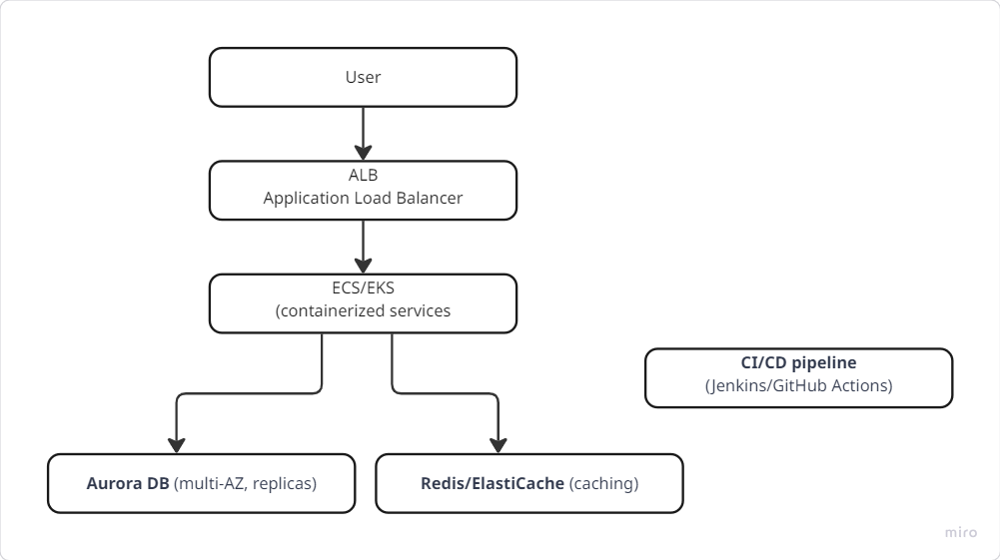

# SaaS Infrastructure Automation & Deployment



🔗 [Architecture Diagram (Miro Embed)](https://miro.com/app/live-embed/uXjVJR_35HQ=/?embedMode=view_only_without_ui&moveToViewport=-1247%2C-497%2C967%2C458&embedId=715496053132)

🔗 [Miro Board Link](https://miro.com/welcomeonboard/dzBvTmxpak1tRmNVamo4eHBiaFZhelNjb2MxQlZEVkZXM25YdVJmZkRPZHd6U2dJdFR5YTFkekxpK0tmOWFTRWd0N2szeHlZNjlSK25UdzlaQTFLZmFmay9RbWkyS052OUVYcjRkTGNBbzNiZUhtT2JWcmNveXN1WlJGelNtTi90R2lncW1vRmFBVnlLcVJzTmdFdlNRPT0hdjE=?share_link_id=342912202277)

---

## Overview
This repository contains **Terraform IaC** and a **GitHub Actions pipeline** to provision and deploy a SaaS application on AWS in a secure, automated, and scalable way.

---

## Infrastructure
- **VPC**: 2 public + 2 private subnets, Internet Gateway, NAT Gateway, route tables  
- **Security Groups**: least privilege (ALB open on 80/443, EC2 only from ALB SG)  
- **EC2 instances**: staging + production (deployed into private subnets)  
- **Application Load Balancer (ALB)**:
  - Default → Production Target Group  
  - Path rule `/staging*` → Staging Target Group  
- **IAM**: EC2 Instance Role with SSM + ECR ReadOnly policies  
- **ECR**: container image repository  
- **SSM Parameter Store**: keeps current image tag for staging and production  

Terraform code is under `/infra`.

---

## CI/CD Pipeline
- **Authentication**: GitHub → AWS via **OIDC role assumption** (no static keys)  
- **Build & Test**: on every push  
- **Docker Build & Push**: tag image with commit SHA + `latest`, push to ECR  
- **Deploy to Staging**: on `develop` branch → update SSM param + redeploy EC2 via RunCommand  
- **Deploy to Production**: on `main` branch → update SSM param + redeploy EC2 via RunCommand  
- **Rollback Job**: reverts to previous image tag from SSM Parameter Store if deploy fails  

Pipeline config is under `.github/workflows/ci-cd.yml`.

---

## Secrets Management
- All **sensitive data** in **AWS SSM Parameter Store** or **AWS Secrets Manager**  
- **GitHub Secrets** used for OIDC role ARN & repo info (no static credentials)  
- No plaintext secrets in repo  

---

## Deployment
```bash
cd infra
terraform init
terraform apply -var="name=saas" -var="aws_region=us-east-1"
