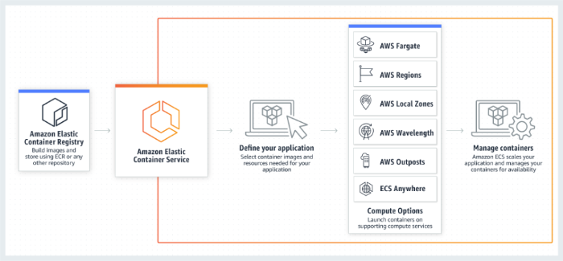

# SaaS Infrastructure Automation & Deployment


https://miro.com/app/live-embed/uXjVJR_35HQ=/?embedMode=view_only_without_ui&moveToViewport=-1247%2C-497%2C967%2C458&embedId=715496053132

https://miro.com/welcomeonboard/dzBvTmxpak1tRmNVamo4eHBiaFZhelNjb2MxQlZEVkZXM25YdVJmZkRPZHd6U2dJdFR5YTFkekxpK0tmOWFTRWd0N2szeHlZNjlSK25UdzlaQTFLZmFmay9RbWkyS052OUVYcjRkTGNBbzNiZUhtT2JWcmNveXN1WlJGelNtTi90R2lncW1vRmFBVnlLcVJzTmdFdlNRPT0hdjE=?share_link_id=342912202277

## Overview
This repo contains Terraform IaC + GitHub Actions pipeline to provision and deploy a SaaS app on AWS.

## Infrastructure
- VPC with subnets
- Security Groups (least privilege)
- EC2 instances: Staging + Production
- Production behind an Elastic Load Balancer
- Terraform code under `/infra`

## CI/CD Pipeline
- Trigger on push
- Build + test
- Build Docker image, push to ECR
- Deploy to **Staging** (develop branch)
- Deploy to **Production** (main branch)
- Rollback job: redeploy last stable Docker image

## Secrets Management
- AWS Secrets Manager or SSM Parameter Store used for all sensitive data
- No plaintext secrets in repo
- Pipeline uses GitHub Secrets (AWS_ACCESS_KEY_ID, AWS_SECRET_ACCESS_KEY, AWS_ACCOUNT_ID)

## Deployment
```bash
cd infra
terraform init
terraform apply
```

## Rollback
- Use `rollback` job in GitHub Actions
- Or re-run pipeline with previous Docker image tag

## Security Considerations
- IAM least privilege roles for pipeline & EC2
- All secrets stored in AWS Secrets Manager / GitHub Secrets
- No hardcoded credentials
- Encrypted communication (HTTPS only)


